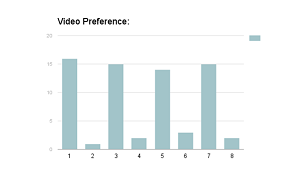
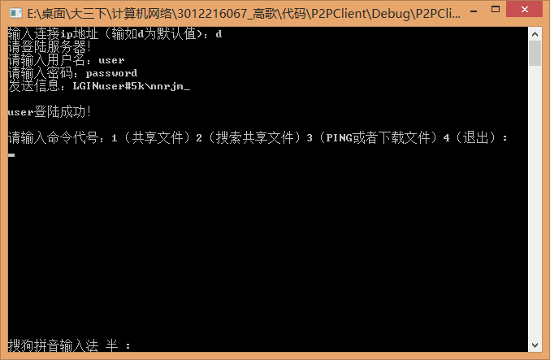
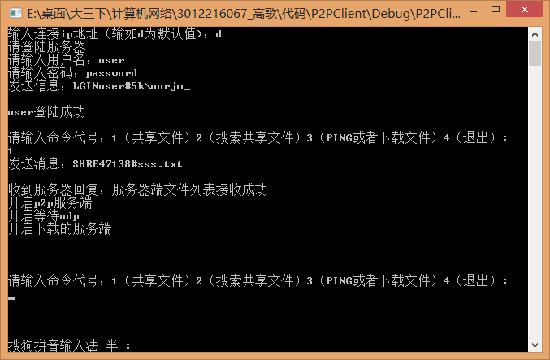
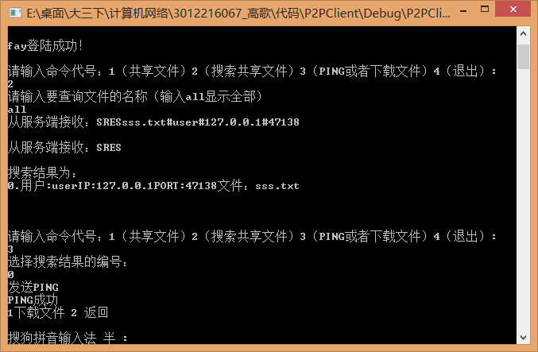
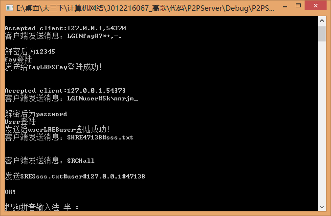

## Ge Gao                       gao412@purdue.edu
  

I am currently a graduate student of Game Innovation Lab at Purdue University. This page is used to show my previous work and what I am interested in now. Please feel free to contact me by email if you are interested in recruitment or referral. 

-----------------------------------------------------------------------------------------------
### Education

M.S. Computer Graphics, Purdue University (Minor: Statistics)

B.E. Computer Science, Tianjin University

2014 Summer Session, UC,Berkeley

#### Selected Courses

Visualization in Sciencific Computing&emsp;&emsp;&emsp;&emsp;&emsp;90

Principles of Database &emsp;&emsp;&emsp;&emsp;&emsp;&emsp;&emsp;&emsp;&emsp;&emsp;&emsp;92

Computer Graphics&emsp;&emsp;&emsp;&emsp;&emsp;&emsp;&emsp;&emsp;&emsp;&emsp;&emsp;&emsp; 93

Quantum Computing &emsp;&emsp;&emsp;&emsp;&emsp;&emsp;&emsp;&emsp;&emsp;&emsp;&emsp;96(top 1)

Control Techniques of Computer&emsp;&emsp;&emsp;&emsp;&emsp;&emsp;&emsp;90(top 1)

Computational Geometry&emsp;&emsp;&emsp;&emsp;&emsp;&emsp;&emsp;&emsp;&emsp;&emsp;96(top 1)

Equation of Mathematics & Physics&emsp;&emsp;&emsp;&emsp;&emsp;&emsp;98(top 1)

Game & VR Development&emsp;&emsp;&emsp;&emsp;&emsp;&emsp;&emsp;&emsp;&emsp;&emsp; A

Advanced Real-Time Computer Graphics &emsp;&emsp;&emsp;&ensp; A+

Statistics Methods &emsp;&emsp;&emsp;&emsp;&emsp;&emsp;&emsp;&emsp;&emsp;&emsp;&emsp;&emsp;&emsp;A

-----------------------------------------------------------------------------------------------
### Work Experience
 

2017.May-2017.Aug &emsp;&emsp; I worked in **[NetEase Games](http://game.163.com/en/)** as a Senior Software Engineer Intern. I mainly did research on super-dense tree covering in 3D large scene and keeping the balance between good visual effect and well GPU performance based on PC platform and D3D9.0 API.

-----------------------------------------------------------------------------------------------

### Projects
 
**A game based on UE4 - Tofu Game!**

*Ge Gao, Matin Chang, Welly Chang, Prescott Ha*

We made this 2.5D game based on UE4, Maya and so on. I worked as a programmer to control triggers and AI in game, and I also worked as an artist(I made the tableware XD).

  

**Flight Simulator in VR Environment**

*Ge Gao, Xiaoyi Huang*

We built an interactive flight simulator in VR environment using traditional input devices such as keyboard, combined with third-party input devices specifically designed for VR devices, such as LeapMotion. (Using OpenGL)

<video width="480" height="320" controls>
<source src="cgt521_GG&XYH_baofeng.bhd">
</video>

**A research - Preferred Color of Light in Indoor Settings for Computer Generated Imagery**

*Jessica Balfe, Ge Gao, Sri Rama Kartheek Kappagantula, Yushan Wei*

We wanted to study whether warm lights are preferred in virtual indoor environment. We conducted an experiment which we showed videos(We built using Maya) to our participants, each video containing a walkthrough of an indoor room with warm white light, cool white light, dark and bright furnature. Our results indicate that majority of people prefer warm light to cool light in different conditions and that the parameters Intensity of light and color of furniture have little effect on a person’s preference for color of light.

  

**Private Tracker - Peiyang PT**

*Ge Gao*

&emsp;&emsp;&emsp;
